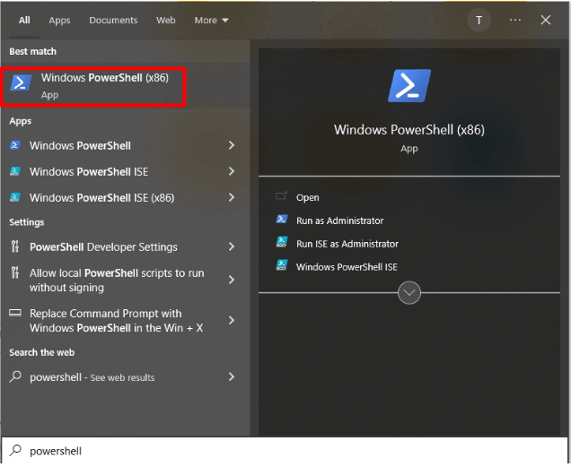
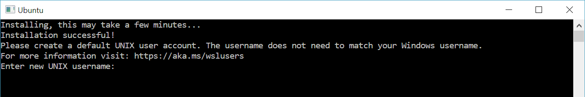

# For Windows People

_or those sufficiently dense and cannot follow simple instructions._

1. Open Powershell in administrator mode (click "Run as Administrator")



2. Create `wsl` (Windows Subsystem for Linux) instance:

```powershell
wsl --install
```

3. Open the WSL by searching for "Ubuntu", click the nearest you recognize, this will open this up:



4. Setup your username and password with whatever you want. Note that nothing will show as you type your password, this is known as _blind typing_.

5. Update the system using:

```bash
sudo apt update && sudo apt upgrade
```

6. Install `curl` and `python`

```bash
sudo apt install curl python3 python3-pip
```

7. Run the setup script using this:

```bash
curl -s -o- https://raw.githubusercontent.com/iaacornus/comp_bio_workshop/refs/heads/main/setup.sh | bash
```

# Install Python

Download Python from [python.org](https://www.python.org/downloads/)
for your specific operating system (OS) and install accordingly. Do
not change any of the default settings and PATH in the installation.

Test the Python installation with:

```
python --version
# should print something like 3.12.6 or closer.
```

# Install Git

`git` is a version control system (VCS). You can download `git` from
[git-scm.com](https://git-scm.com/downloads) for your OS. Install `git`
without changing any of the default settings and PATH in settings. Test
the installation with:

```
git -v
# should print something like git version 2.46.0 or closer.
```

# Code Editor

VSCode is recommended, but any code editor with UTF-8 encoding should
suffice for this purposes. List of some code editor:

1. VSCode from [https://code.visualstudio.com/](https://code.visualstudio.com/)
2. Sublime Text from [https://www.sublimetext.com/](https://www.sublimetext.com/)
3. Notepad++ from [https://notepad-plus-plus.org/](https://notepad-plus-plus.org/)
4. Atom from [https://atom-editor.cc/](https://atom-editor.cc/)

If you want to use Integrated Development Environment, you can:

1. PyCharm from [https://www.jetbrains.com/pycharm/](https://www.jetbrains.com/pycharm/)
2. Spyder from [https://www.spyder-ide.org/](https://www.spyder-ide.org/)
3. Thony from [https://thonny.org/](https://thonny.org/)

You can also use other code editor/IDE of your preference.


